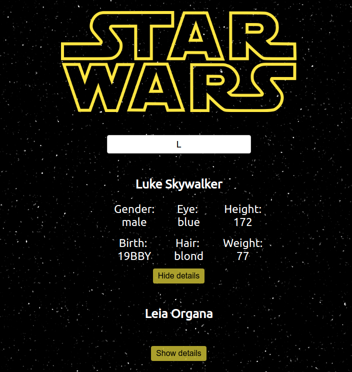

# React Swapi API

This programme enables you to search for 'People' from the Star Wars movies and get their details.

## Screenshot



## User story

As a user, I can search for people from the Star Wars movies using the open source Star Wars API.

## Requirement

Uses an autocomplete search to search for 'People' from the Star Wars movies.

## Technology

React

ES6+

## To install

```bash
npm install
```

## To run

```bash
npm start
```

Open [http://localhost:3000](http://localhost:3000) to view it in the browser.

## Edge cases

Feedback to the user:

- If the search box is empty: "Search a character!"
- If the search box is full: "Maximum length reached!"
- If there is no corresponding: "Nobody has this name here!"

## Improvements

With more time I would:

- Perform tests with Jest and Cypress, unit and end-to-end.
- Optimise the use of SWAPI, call quantity versus frequency.
- Give the user access to more data for each person.
- Simplify data flow with redux when possible.
